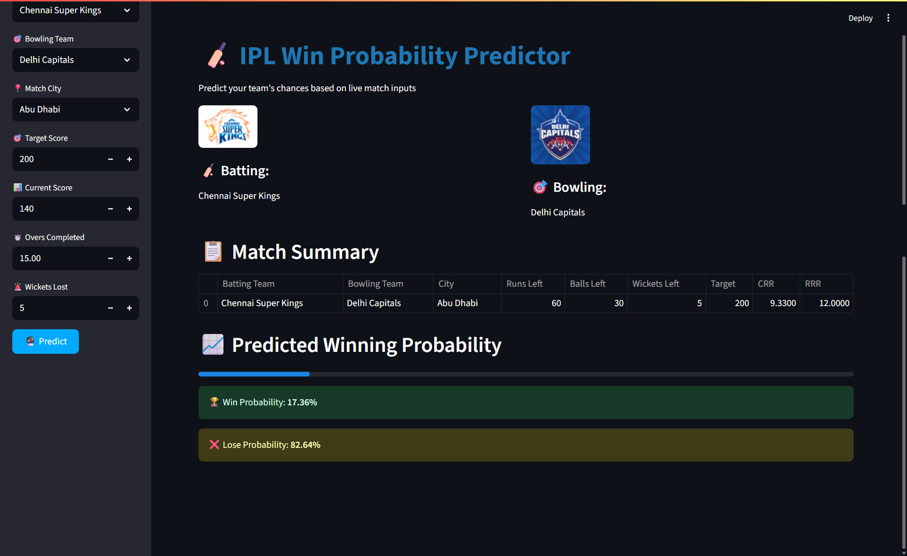

# 🏏 IPL Win Probability Predictor


This project predicts the **win probability of a team chasing a target in an IPL match** based on live match inputs like current score, overs completed, wickets lost, and match city.

Using machine learning and ball-by-ball IPL data, the app gives **real-time win/lose probability** visualizations powered by a trained logistic regression model.

---

## 📸 App Screenshot



---

## 📁 Project Structure

```
📦IPL_Win_Predictor/
├── app.py                             # Streamlit app frontend
├── IPL Win Probability Predictor.ipynb # Full data prep + model training notebook
├── Final_Pipeline.pkl                 # Trained pipeline (preprocessing + model)
├── deliveries.csv                     # Ball-by-ball delivery data
├── matches.csv                        # Match-level IPL data
├── requirements.txt                   # Required libraries
├── IPL Predictor App SS.png           # Screenshot of final UI
├── README.md                          # Project documentation
```

---

## 🎯 Features

- 📊 Predicts **real-time win probabilities** during a run chase
- ⚡ Built with **scikit-learn**, **pandas**, and **Streamlit**
- 🧠 Uses a **Logistic Regression model** trained on IPL historical data
- 🔁 Handles match logic like runs/wickets/balls remaining and DLS exclusions
- 🧮 Shows progression over overs with win/lose visualizations

---

## ⚙️ App Inputs

- **Batting Team**
- **Bowling Team**
- **City** where the match is played
- **Target Score**
- **Current Score**
- **Overs Completed**
- **Wickets Lost**

---

## 🧪 Model Details

- **Target Variable**: Binary (1 = Chasing team won, 0 = Lost)
- **Features Used**:
  - Batting Team (OHE)
  - Bowling Team (OHE)
  - City (OHE)
  - Runs Left
  - Balls Left
  - Wickets Left
  - Current Run Rate (CRR)
  - Required Run Rate (RRR)
  - Target Score

- **Model Type**: Logistic Regression
- **Pipeline**: Preprocessing (OneHotEncoding) + Model in `Final_Pipeline.pkl`

---

## 💾 Setup Instructions

### 🔧 Clone the Repository

```bash
git clone https://github.com/sg2499/IPL_Win_Predictor.git
cd IPL_Win_Predictor
```

### 🐍 Create a Virtual Environment (Recommended)

```bash
conda create -n ipl_env python=3.10
conda activate ipl_env
```

### 📦 Install Dependencies

```bash
pip install -r requirements.txt
```

---

## 🚀 Run the App

```bash
streamlit run app.py
```

---

## 📝 Data Sources

- `matches.csv` — match-level data from IPL seasons
- `deliveries.csv` — ball-by-ball IPL data (used to compute features like runs left, balls left, CRR, etc.)

---

## 📈 How It Works

1. Preprocess and merge `matches.csv` and `deliveries.csv`
2. Filter for second innings only (chasing side)
3. Engineer features like:
   - `Runs Left = Target - Current Score`
   - `Balls Left = 120 - (overs * 6)`
   - `Wickets Left = 10 - wickets`
   - `CRR`, `RRR`
4. Encode teams and city using `OneHotEncoder`
5. Train a `LogisticRegression` model with a pipeline
6. Deploy model inside a Streamlit app for live predictions

---

## ✅ Requirements

See `requirements.txt`:

```txt
streamlit
pandas
numpy
scikit-learn
ipykernel
seaborn
matplotlib
```

---

## 📬 Contact

For feedback or collaboration, feel free to reach out at **[shaileshgupta841@gmail.com]**  
or connect via [GitHub – sg2499](https://github.com/sg2499)

---

> Built with ❤️ using Scikit-learn, Pandas, and Streamlit.
